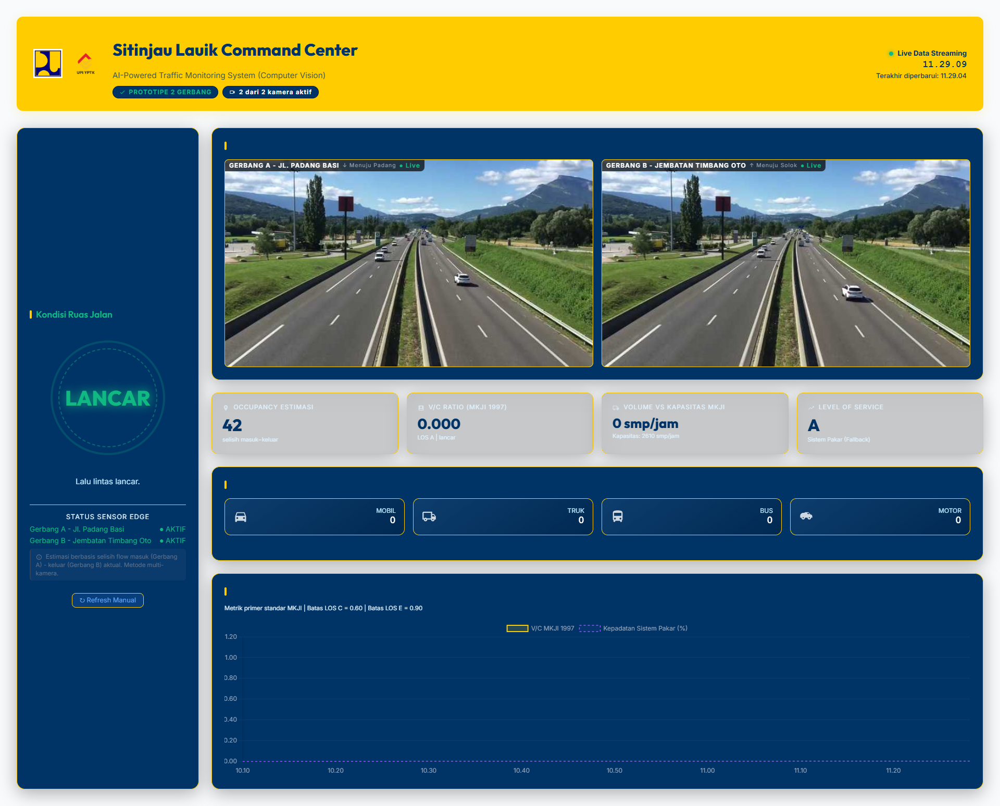

# 🚦 Sitinjau Lauik AI Traffic Monitoring System


<div align="center">
  
</div>

Sistem cerdas berbasis **Computer Vision (AI)** dan **Internet of Things (IoT)** untuk mendeteksi, menghitung, dan menganalisis tingkat kemacetan lalu lintas secara *real-time* di ruas jalan ekstrem **Sitinjau Lauik (Padang - Solok)**. 

Proyek ini dirancang secara khusus untuk berjalan di *Edge Device* (seperti **Raspberry Pi 8GB/16GB**) terhubung ke **2 Kamera CCTV (Gerbang Padang Besi & Gerbang Jembatan Timbang Solok)**, menggunakan jaringan nirkabel/Wi-Fi dengan lalu lintas data yang sangat efisien.

---

## 🏗️ 1. Arsitektur Sistem (Event-Driven Microservices)

Sistem dibagi menjadi 4 layer utama yang saling lepas (*decoupled*) agar tangguh, efisien, dan *scalable*:

1. **Edge AI Layer (`src/main.py`)** - *Berjalan di Raspberry Pi (Edge)*
   - Membaca RTSP stream dari 2 CCTV secara multi-threading.
   - Deteksi objek dengan model **YOLOv8 Nano** (teroptimasi 320x320) atau versi NCNN/ONNX.
   - Melacak pergerakan (*ByteTrack*) dan menghitung kendaraan yang melewati garis imajiner (*Line Crossing*).
   - Mengirim data JSON agregasi yang sangat ringan setiap 20 detik ke pusat menggunakan protokol MQTT.
   - Dilengkapi *Watchdog* otomatis untuk pemantauan suhu dan memori.
2. **Transport Layer (MQTT Broker)** - *Jembatan Komunikasi*
   - Menggunakan **Eclipse Mosquitto**.
   - Dilengkapi sistem *Local Buffer* 5MB (data tidak hilang meski sinyal Wi-Fi putus sementara) dan *Last Will and Testament (LWT)* untuk mendeteksi status kamera (Aktif/Offline).
3. **Core Server Layer (`src/mqtt_consumer.py`)** - *Berjalan di Server Pusat*
   - Berlangganan topik MQTT dan menerima data dari kedua gerbang secara asinkron.
   - Menghitung **Occupancy** jaringan jalan (Selisih akumulasi kendaraan Masuk vs Keluar antar gerbang).
   - Menjalankan komputasi tingkat layanan jalan (LOS) berdasar metodologi MKJI 1997 dan heuristik Sistem Pakar.
   - Menyimpan seluruh raw counter, status agregasi, dan matriks ke **PostgreSQL**.
4. **Presentation Layer (`src/api_server.py`)** - *Dashboard UI*
   - REST API (FastAPI) mem-push data terbaru menggunakan **WebSocket** ke antarmuka web HTML/JS.
   - Dashboard memvisualisasikan tingkat kemacetan (*Gauge V/C Ratio*), matriks kendaraan 5 menit terakhir, serta menampilkan live stream dari tepi ruas (*edge*).

---

## 📊 2. Logika Perhitungan & Metodologi 

Sistem ini tidak sekadar menebak kemacetan melainkan menggunakan hibridisasi antara standar pedoman nasional dengan pendekatan rekayasa heuristik.

### A. Standar MKJI 1997 (Metrik Primer)
Menggunakan **Manual Kapasitas Jalan Indonesia (MKJI) 1997** untuk jalan tipe 2/2 UD (Dua Lajur Dua Arah Tak Terbagi):

**Kapasitas Jalan ($C$)**
Kapasitas Dasar ($C_0$) untuk jalan 2/2 UD secara teoritis adalah **2900 smp/jam** (satuan mobil penumpang).
Kapasitas riil ditentukan dengan rumus koreksi:
```text
C = C0 × FCW × FCSP × FCSF × FCCS

Dimana:
C0   = 2900 smp/jam
FCW  = Faktor lebar jalur (Default: 0.90)
FCSP = Faktor pemisahan arah (Default: 1.00)
FCSF = Faktor hambatan samping (Default: 1.00)
FCCS = Faktor ukuran kota (Default: 1.00)
```

**Ekuivalensi Mobil Penumpang (EMP)**
Karena kontur pegunungan (Sitinjau Lauik) ekstrem, bobot kendaraan berat memiliki dampak signifikan terhadap arus jalan:
- Sepeda Motor (MC): **0.40 smp**
- Kendaraan Ringan / Mobil (LV): **1.00 smp**
- Bus Sedang/Besar: **3.25 smp**
- Truk Sedang/Besar: **5.00 smp**

Sistem menerapkan **Rolling Average 15 Menit** dari database untuk menstabilkan input volume dari edge (per 20 detik) ke bentuk volume historis per jam (dikali faktor 4).

### B. Level of Service (LOS)
Kepadatan absolut ditentukan dari rasio Volume lalu lintas terhadap Kapasitas ruas jalan (V/C Ratio):
- **LOS A**: V/C $\le 0.20$ (Sangat Lancar)
- **LOS B**: V/C $\le 0.44$ (Lancar)
- **LOS C**: V/C $\le 0.75$ (Mulai Padat)
- **LOS D**: V/C $\le 0.84$ (Padat Merayap)
- **LOS E**: V/C $\le 1.00$ (Mendekati Macet)
- **LOS F**: V/C $> 1.00$ (Macet Total)

### C. Heuristik Sistem Pakar (Hybrid Override)
Pendekatan MKJI memiliki kelemahan untuk kondisi jalan ekstrem: saat V/C Ratio rendah namun ada truk patah as/mogok melintang di tikungan, jalan tetap macet meski volume kecil. Untuk itu, sistem kami mengimplementasi status Hybrid:
> Jika mendeteksi **kecepatan rata-rata kendaraan $\le 15$ km/jam** secara real-time dari tangkapan kamera (*optical flow*), maka status langsung diganti paksa menjadi **MACET TOTAL (LOS F)** terlepas dari angka perhitungan volume.

---

## 💻 3. Teknologi (Tech Stack)

- **AI/Computer Vision**: `Ultralytics YOLOv8`, `ByteTrack`, `OpenCV`
- **Internet of Things (IoT)**: `Paho-MQTT`, `Eclipse Mosquitto`
- **Backend / Core Engine**: `Python 3.11+`, `FastAPI`, `Uvicorn`, `Psycopg2`
- **Database**: `PostgreSQL` (Relasional & Time-Series Friendly)
- **Frontend Dashboard**: Vanilla HTML5/CSS3 (Glassmorphism), `Chart.js`, WebSockets
- **Deployment & Orchestration**: `Docker`, `Docker Compose`

---

## ✨ 4. Fitur Utama & Kegunaan

1. **Dual Gate Monitoring**: Menghitung selisih (Occupancy Net) antara kendaraan masuk dari Padang dan keluar di Solok, dan sebaliknya.
2. **Rolling Average Calculation**: Mengolah *noise* interval MQTT (20 detik) menggunakan buffer riwayat 15 menit ke database, meminimalisir lag/angka 0 pada tampilan V/C Ratio.
3. **Live Camera Feed**: Penayangan video *Multi-Stream* (*Motion JPEG*) dari Edge Device langsung ke Command Center Web dengan latensi minimal.
4. **Interactive Dashboard**: UI/UX responsif menampilkan Gauge V/C Ratio, Breakdown tipe kendaraan (Mobil, Truk, Bus, Motor), tren historis berbasis grafik, dan notifikasi status sensor edge.
5. **Connection & Hardware Watchdog**: Deteksi *stale data* jika MQTT terputus, dan pemantauan termal CPU/RAM untuk auto-reboot Raspberry Pi agar umur perangkat awet.
6. **Auto Database Persistence**: Setiap kalkulasi dan rekaman metrik terekam secara persisten untuk keperluan audit kelak (e.g., Export to CSV, dll).

---

## 🚀 5. Cara Menjalankan Sistem (Quick Start)

Metode termudah untuk menjalankan proyek ini pada tahap *production* adalah menggunakan Docker.

### 1. Kloning Repository & Persiapan Lingkungan
```bash
git clone https://github.com/MAHEZANOVRAYUDA/Computer-Vision-Sitinjau-Lauik.git
cd Computer-Vision-Sitinjau-Lauik

# Konfigurasi file .env (ubah kredensial database sesuai kebutuhan)
cp .env.example .env
```

### 2. Jalankan Seluruh Infrastruktur dengan Docker
Sistem sudah dilengkapi dengan multi-stage Dockerfile yang ringan.
```bash
# Menjalankan Database, MQTT Broker, Edge Nodes, Consumer, dan API
docker compose up -d
```
*Perintah ini otomatis akan menjalankan:*
- `sitinjau_mqtt` (Mosquitto Broker)
- `sitinjau_db` (PostgreSQL - *jika di-enable pada compose*)
- `sitinjau_edge_a` (AI Node Gerbang Padang Besi)
- `sitinjau_edge_b` (AI Node Gerbang Solok)
- `sitinjau_consumer` (Core Processing & MKJI calculation)
- `sitinjau_api` (Backend & Dashboard Server)

### 3. Akses Dashboard
Buka browser dan akses:
- **Dashboard Live:** `http://localhost:8000/dashboard`
- **Cek Status Health:** `docker compose ps`

---

## 🔧 6. Menjalankan Tanpa Docker (Manual)

Bagi yang ingin men-debug atau *tuning* parameter secara langsung di IDE:

1. Buat Virtual Environment & Install dependencies:
   ```bash
   python -m venv venv
   source venv/bin/activate  # Di Windows: venv\Scripts\activate
   pip install -r requirements.txt
   ```
2. Pastikan **PostgreSQL** dan **Mosquitto** berjalan di perangkat lokal Anda.
3. Jalankan Consumer (Server Pusat):
   ```bash
   python src/mqtt_consumer.py
   ```
4. Jalankan Edge AI Node (Buka terminal baru):
   ```bash
   python src/main.py --config config/config_gerbang_a.yaml
   ```
5. Buka terminal baru dan Jalankan API Dashboard:
   ```bash
   python src/api_server.py
   ```

---

## 📂 7. Struktur Direktori Utama

```text
📦 Computer-Vision-Sitinjau-Lauik
 ┣ 📂 config/            # File YAML untuk konfigurasi sensitivitas deteksi, dll
 ┣ 📂 dashboard/         # Antarmuka web HTML/JS & WebSocket & Aset
 ┣ 📂 models/            # Tempat menyimpan file .pt (YOLO weights)
 ┣ 📂 scripts/           # Script utilitas & database (kalibrasi, evaluasi, setup.sql)
 ┣ 📂 src/
 ┃ ┣ 📜 api_server.py    # FastAPI & WebSocket server
 ┃ ┣ 📜 database.py      # PostgreSQL Connection Pooling
 ┃ ┣ 📜 detector.py      # Integrasi Ultralytics YOLO & ByteTrack
 ┃ ┣ 📜 event_publisher.py # Modul MQTT Edge + Auto Recovery Buffer
 ┃ ┣ 📜 main.py          # Entry point Edge (Raspberry Pi)
 ┃ ┣ 📜 mkji.py          # Algoritma perhitungan LOS standar MKJI 1997
 ┃ ┣ 📜 model_optimizer.py # Eksportir model ke ONNX/NCNN untuk PI
 ┃ ┣ 📜 mqtt_consumer.py # Server pengolah metrik dari seluruh gerbang
 ┃ ┣ 📜 sistem_pakar.py  # Hybrid Rule-Based Evaluation
 ┃ ┣ 📜 video_source.py  # Asynchronous multi-threading Video Capture
 ┃ ┗ 📜 watchdog.py      # Pemonitor suhu & RAM khusus Raspberry Pi
 ┣ 📜 docker-compose.yml # Orkestrasi Production
 ┣ 📜 Dockerfile         # Image Builder Edge/Core
 ┗ 📜 README.md          # Dokumentasi ini
```

---

*Dikembangkan secara intensif dan profesional untuk memecahkan tantangan lalu lintas ekstrem Sitinjau Lauik dengan teknologi AI terdepan dan parameter validasi nyata lalu lintas.*
