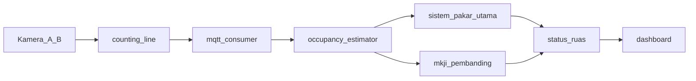

# Rencana Revisi Sitinjau Lauik (PRD v3)

## Temuan setelah baca kode (penting)

PRD v3 mengasumsikan [`src/mkji.py`](src/mkji.py) **kode mati**. Kenyataannya sudah dipanggil di [`src/mqtt_consumer.py`](src/mqtt_consumer.py) dan disimpan ke kolom `*_mkji` di [`src/database.py`](src/database.py). Masalahnya terbalik dari yang dikira PRD: **dashboard menjadikan MKJI sebagai status utama**, padahal yang valid sebagai status operasional adalah occupancy-based di [`src/sistem_pakar.py`](src/sistem_pakar.py).

```686:688:dashboard/index.html
    // Status utama — tampilkan dari MKJI jika tersedia, fallback ke sistem pakar
    const mkjiStatus = data.status_label_mkji || data.status_label || "memuat";
    const statusLabel = mkjiStatus.toLowerCase();
```

[`README.md`](README.md) masih menyebut MKJI sebagai **metrik primer**. File [`docs/PARAMETER_MKJI.md`](docs/PARAMETER_MKJI.md) sudah terhapus di working tree (belum di-commit).

Bug kualitas yang harus ikut batch 1: di `mqtt_consumer.py`, identifikasi gerbang memakai `"a" in gerbang_id.lower()`. String `"gerbang_b"` **mengandung huruf `a`**, jadi data Gerbang B bisa masuk ke kumulatif A dan occupancy ruas salah.

```158:164:src/mqtt_consumer.py
                    gl = gerbang_id.lower()
                    if "a" in gl:
                        if arah == "masuk": self.kumulatif_a_masuk[kelas] += jumlah
                        ...
                    elif "b" in gl:
```

Drift skema: [`scripts/migrate_db.py`](scripts/migrate_db.py) menambah kolom `vc_ratio_mkji` / `los_mkji`, sementara [`scripts/setup_database.sql`](scripts/setup_database.sql) dan `database.py` memakai `rasio_vc_mkji` / `level_of_service_mkji`.

Rumus **tidak dibongkar**. Occupancy (`hitung_occupancy_ruas`) dan KVR + hybrid speed override tetap. Yang diubah: nama, prioritas UI, kejujuran dokumentasi, dan kualitas pipeline.



## Cara kerja bertahap

PRD: jangan lanjut tahap berikutnya sebelum DoD terpenuhi dan `pytest tests/` lulus. Setelah rencana ini disetujui, **implementasi langsung hanya Tahap 0–1**. Tahap 2 butuh video/label manusia dari Anda. Tahap 5 dan 7 butuh pengukuran lapangan / hardware.

---

## Tahap 0 — Baseline

- Jalankan `pytest tests/ -v`, simpan output ke [`docs/BASELINE_TEST_SEBELUM_REVISI.txt`](docs/BASELINE_TEST_SEBELUM_REVISI.txt).
- Branch `revisi/rumus-dan-metodologi`.
- Salin `config/*.yaml` ke `config/backup_sebelum_revisi/`.

---

## Tahap 1 — Penamaan jujur + MKJI sebagai pembanding + kualitas pipeline

**Dokumentasi**

- Tulis ulang bagian metodologi di [`README.md`](README.md): occupancy-based = **metrik utama**; MKJI 1997 = **pembanding indikatif** (gradien Sitinjau Lauik 20–26% di luar cakupan normal MKJI). Turunkan klaim "Production Ready".
- Buat [`docs/METODOLOGI_PERHITUNGAN.md`](docs/METODOLOGI_PERHITUNGAN.md) (pengganti `PARAMETER_MKJI.md`): Bagian A occupancy/KVR/hybrid speed; Bagian B rumus MKJI `C = C0 × FCw × …` sebagai pembanding.
- Perbaiki docstring di [`src/sistem_pakar.py`](src/sistem_pakar.py): `tentukan_level_of_service` **meniru breakpoint LOS**, bukan "sesuai MKJI". Komentar config `metrik UTAMA` di yaml diubah jadi pembanding.

**Dashboard (prioritas dibalik)**

- Status besar = `status_label` occupancy-based.
- Kartu occupancy / rasio kepadatan (kolom `rasio_vc` yang sebenarnya occupancy ratio) sebagai primer.
- MKJI (`rasio_vc_mkji`, `level_of_service_mkji`) sekunder dengan catatan: *Estimasi V/C MKJI indikatif, medan gunung standar — gradien 20–26% melebihi cakupan normal MKJI*.

**Kode**

- Perbaiki matching gerbang: exact `gerbang_a` / `gerbang_b` (bukan `"a" in ...`).
- Samakan [`scripts/migrate_db.py`](scripts/migrate_db.py) dengan skema SQL yang dipakai `database.py` (kolom sudah ada: `rasio_vc_mkji`, bukan `mkji_vc_ratio` baru).
- Pastikan `evaluasi_mkji()` tetap dipanggil **setelah** `evaluasi()`, input flow 15 menit × 4 tetap (itu benar untuk MKJI berbasis arus/jam; occupancy tetap dari kumulatif dual-gerbang).

**Tes**

- Tambah [`tests/test_perbandingan_metodologi.py`](tests/test_perbandingan_metodologi.py): data sintetis yang sama → occupancy vs MKJI, assert keduanya jalan dan bedanya terdokumentasi (bisa assertion + komentar/skenario).
- Tes unit matching gerbang (reproduksi bug `gerbang_b` tidak boleh masuk bucket A).
- Semua tes lama harus tetap lulus.

**DoD Tahap 1:** tidak ada klaim "status utama = MKJI"; MKJI tersimpan dan tampil sebagai sekunder; tes baru + lama hijau.

---

## Tahap 2 — Validasi ambang (bergantung data Anda)

Tidak bisa diselesaikan dari kode saja. Setelah ada 5–8 video (sepi/ramai, naik/turun):

- Ground truth manual vs output `sistem_pakar`.
- Kalibrasi `ambang_lancar` / `ambang_padat` / `ambang_kecepatan_lambat_kmh` di config **hanya jika data mendukung**; jika angka lama dipertahankan, tulis justifikasi.
- Tulis [`docs/HASIL_VALIDASI_LAPANGAN.md`](docs/HASIL_VALIDASI_LAPANGAN.md).

Bisa disiapkan dulu: template dokumen + skrip bantu yang membandingkan label CSV dengan output evaluasi (tanpa mengarang angka lapangan).

---

## Tahap 3 — Arah topografi naik/turun

- Field `arah_topografi: naik|turun` di `counting_lines` (terpisah dari `arah: masuk|keluar`) di ketiga yaml.
- Simpan kecepatan rata-rata per arah topografi; kolom `arah_topografi` di `hitungan_kendaraan` + migrasi SQL.
- Dokumentasikan: sistem = congestion monitor, bukan prediktor kecelakaan.
- Ambang kecepatan naik vs turun: isi default wajar, kalibrasi final menunggu Tahap 2.

---

## Tahap 4 — Keamanan dasar

- CORS di [`src/api_server.py`](src/api_server.py): ganti `allow_origins=["*"]` dengan daftar dari config/env.
- API key sederhana untuk endpoint sensitif (bukan WebSocket dashboard lokal jika terlalu merusak demo — tentukan daftar endpoint tulis/export).
- [`config/mosquitto.conf`](config/mosquitto.conf) saat ini `allow_anonymous true`; untuk lapangan: anonim mati + komentar cara auth; localhost boleh tetap longgar via file terpisah.
- Lengkapi [`.env.example`](.env.example) (`DB_HOST`, `CORS_ORIGINS`, `API_KEY`); pastikan `.env` tetap di gitignore.

---

## Tahap 5 — Deteksi motor (bergantung data/model)

- Threshold confidence khusus kelas motor di config/detector.
- Evaluasi YOLO11 opsional setelah baseline recall terukur (`scripts/evaluasi_deteksi.py` / `fine_tune.py`).
- Jangan migrasi model sebelum ada angka precision/recall.

---

## Tahap 6 — Frontend ringan

- Bundle Chart.js lokal (hapus CDN jsDelivr).
- Alpine.js untuk reaktivitas ringan; responsif mobile; UI kegagalan WebSocket (sudah ada stale banner — perlu dipertegas).

---

## Tahap 7 — Edge & CI

- Aktifkan [`src/watchdog.py`](src/watchdog.py) dari [`src/main.py`](src/main.py) (sekarang tidak terpasang).
- CI GitHub Actions: `pytest` + lint saja.
- Catatan FPS Pi 5 / TFLite: template dokumen, angka diisi setelah uji hardware.
- Backup `pg_dump` cron: skrip + contoh crontab, tidak mengarang bahwa sudah jalan di lapangan.

---

## Yang sengaja tidak diubah

- Formula KVR, occupancy dual-gerbang, hybrid override kecepatan.
- Klaim safety-critical, prediksi kecelakaan, atau "implementasi MKJI murni".
